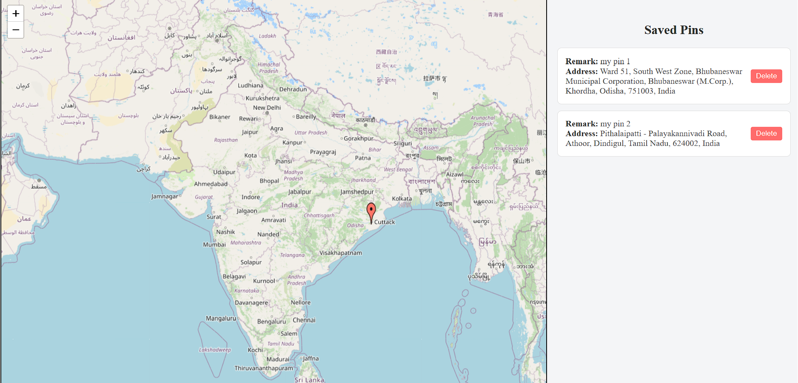

# MarkMap

MarkMap is a user-friendly tool for dropping pins on a map, adding remarks, and saving locations for future reference. Designed to make location tracking easy, it allows users to mark specific spots, add optional remarks, view saved pins in a list, and revisit those locations anytime. Built with React and Leaflet, MarkMap is fully responsive and interactive.

## Live Demo

[Here is my deployed app link](https://your-deployment-link.com)

## Features

- **Interactive Map**: Drop pins on a map and see the exact locations.
- **Add Remarks**: Enter optional notes or remarks for each pin.
- **Automatic Address Fetching**: Retrieves address based on pin location.
- **Pin List Sidebar**: View all saved pins in a sidebar list with remarks and addresses.
- **Pin Navigation**: Click a saved pin to center the map on that location.
- **Persistent Storage**: Pins are saved locally to keep your data across sessions.
- **Delete Functionality**: Option to delete individual pins or clear all pins.


## Tech Stack

- **Frontend**: React, Leaflet (for map functionality)
- **API**: OpenStreetMap's Nominatim API for reverse geocoding
- **Styling**: CSS

## Getting Started

### Prerequisites

- **Node.js** and **npm** installed on your machine.

### Installation

1. Clone the repository:

   ```bash
   git clone https://github.com/your-username/MarkMap.git

2. Navigate to the project directory:
   cd MarkMap
3. Install dependencies:
   npm install

Running Locally
 Start the development server:
   npm start
  

## Usage
Drop Pins: Click on the map to drop a pin. A popup will automatically open for you to add a remark.
View Saved Pins: All saved pins appear in a list on the sidebar with their remarks and addresses.
Navigate to Pins: Click on any pin in the sidebar to center the map on that location.
Delete Pins: Use the delete button next to each pin to remove individual pins or the "Delete All Pins" button to clear all pins.

### Screenshot


## License
This project is open-source and available under the MIT License.

## Acknowledgments
Leaflet: For providing interactive map functionality.
OpenStreetMap Nominatim API: For reverse geocoding and address fetching.